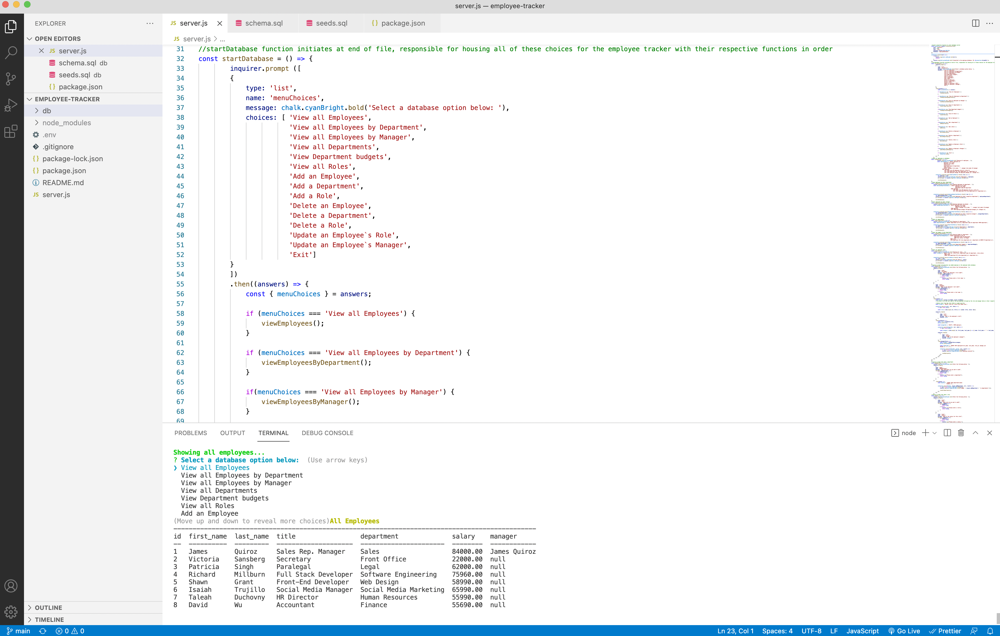

# Employee Tracker

Employee Tracker is a command-line application used to manage a company's employee database.

## Description
For business owners, Employee Tracker is an application that allows one to view and manage the departments, roles, and employees of their workplace.

When the application is started, the user is presented with the following options:

* 'View all Employees' - User is able to view a formatted table showing all of the employees including their data - the employee ids, first and last names, job titles, departments, salaries, and managers that the employee reports to.
* 'View all Employees by Department' - User is able to view the full name of their employee and their respective department.
* 'View all Employees by Manager' - User is able to view the full name of their employee and their respective manager.
* 'View all Departments' - User is able to view a formatted table displaying the departments names and ids.
* 'View Department budgets' - User is able to view the respective budget of each department.
* 'View all Roles' - User is able to view the job title, role id, department where that role resides, and the salary of that role.
* 'Add an Employee' - User is prompted to enter the employee's first and last name, their role, and their manager which is then added to the database.
* 'Add a Department' - User is prompted to enter the name of their database which is then added to the database. 
* 'Add a Role' - User is prompted to enter the name of the role alongside its salary and department which is then added to the database.
* 'Delete an Employee' - User is able to delete an employee from the database and have its changes reflected in the database.
* 'Delete a Role' - User is able to delete a role from the database and have its changes reflected in the database.
* 'Update an Employee`s Role' - User is prompted to select an employee and update their new role which is changed and added to the database. 
* 'Update an Employee`s Manager' - User is prompted to select an employee and update their manager which is changed and added to the database. 
* 'Exit' - User can exit the Employee Tracker and return to the terminal.

From there, the user can select one of these options that display the respective information of their title along with adding their input when updating or adding specific data.

How to Submit the Challenge
You are required to submit BOTH of the following for review:

A walkthrough video demonstrating the functionality of the application. - RECORD VIDEO WHEN PROJECT IS COMPLETED
Because this application won’t be deployed, you’ll also need to create a walkthrough video that demonstrates its functionality and all of the following acceptance criteria being met. You’ll need to submit a link to the video and add it to the README of your project.

The URL of the GitHub repository, with a unique name and a README describing the project.
- https://github.com/trujilml/employee-tracker

## Table of Contents
- [Description](#Description)
- [Installation](#Installation)
- [Usage](#Usage)
- [Developed With](#Developed-with)
- [Further Ideas](#Further-Ideas)

## Installation
- This file can be cloned through GitHub into your own repository by selecting the above Code button.
- The following npm packages listed in the `Developed With` tab are required to install prior to running `node server.js` and initiating the command line.
- To view the database through MySQL, please type `mysql -u root -p`. Please note that with the dotenv package, you will need to add your MySQL password in the respective .env file and add it to the .gitignore file in order to prevent confidental information from leaking.

## Usage
- Open the terminal through either the Integrated Terminal on VS Code or through the Terminal application on Mac OS following the cloned upload of the file with their respective installers present (please view `Developed With` below).
- Type `node server.js` to get started.
- This application allows the user to view, add, edit, and delete their employees, employees' roles, departments, and managers. Users can interact freely in this application. 

## Developed With
- MySQL2 - Continuation package of MySQL. Relational database management system that ensures fast connection to host servers and web databases. The database involves hosting and retrieving the date of the employee, role and manager tables. - https://www.npmjs.com/package/mysql2
- dotenv - An npm package that protects login credentials from other users through the .env file and MySQL. - https://www.npmjs.com/package/dotenv
- console.table - npm package that adds the tables to display in the command line, works with use of MySQL2, Inquirer, Node.js and JS. - https://www.npmjs.com/package/console.table 
- Inquirer - npm package that houses a collection of interactive command line interfaces, where the user is able to interact with the employee tables and add several assets for this employee tracker. - https://www.npmjs.com/package/inquirer
- Chalk - npm package that styles and formats different colors and background for the command line terminal. Colorfully displays results from the inquirer prompts and titles of the inquired employee data tables. - https://www.npmjs.com/package/chalk
- JavaScript - Back-end Development 
- Node.js - Back-end Development 

## Further Ideas
- Implement the option to delete a department again. Initially, this option allowed for users to delete a department. Yet, it resulted in errors when attempting to achieve it in the terminal log. 
